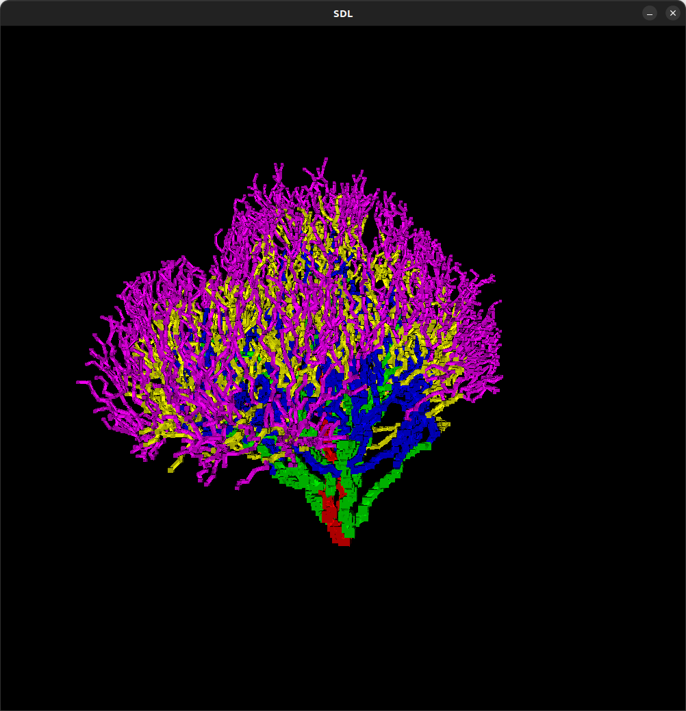
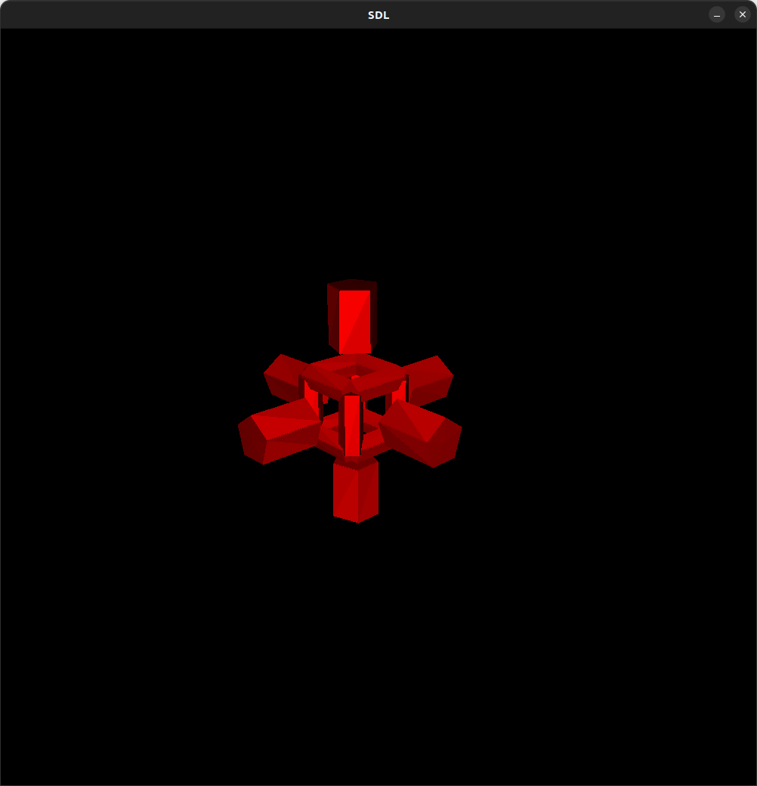
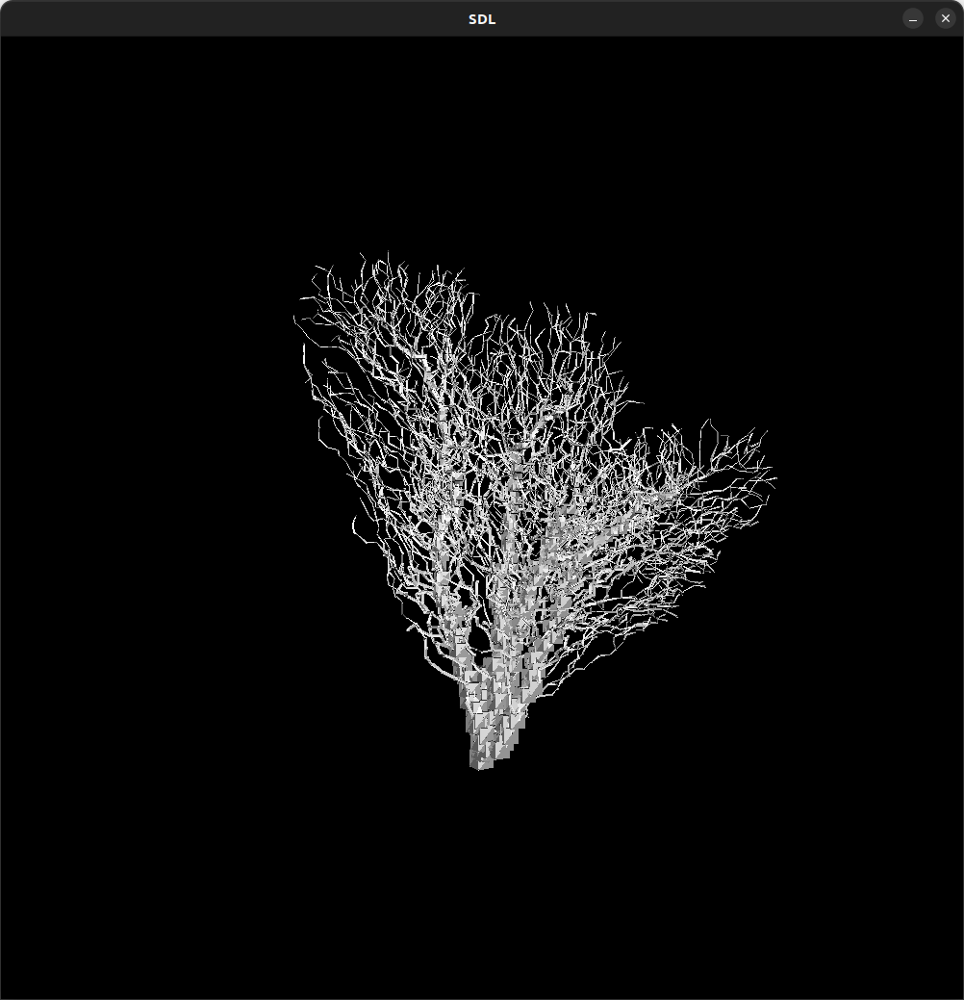

# Making trees
### An attempt to make procedural tree generation program.

The purpose of this project was to implement the main procedural tree generation technics explained in the paper:

The generation is done using a graph where nodes are placed using a Poisson disc distribution and are linked with directed edges in a Yao-8 graph. 
It is an iterative process. In the first step we choose a node as the root/source of the tree and one or several points as end points destination from a given volume. Then we connect the connect the source to the destinations using a shortest path algorithm, here Dijkstra. The cost of each edge is computed using the edge length, the edge direction and the **guiding vector** of the node at the begining of the edge. The guiding vector represent the prefenrential direction of the branch going out of a node. Its computation is part of the parameters of the program. For the next steps, we choose all or a part of the nodes in the existing path as source nodes and some points at a given number of edges from the path as destinations and repeat the shortest path computation. 

The number of endpoint at each step, the volume to sample the first destinations from, the number of jumps from the existing path, and the guiding vector computation function are some of the parameters that we can tweak to obtain different tree shapes using the same algorithm.

This project also include a minimal homemade rasterizer and an even more minimal path sweeping algorithm to give volume to a the tree.
The three parts are divided in three packages core, rasterizer and inflator.

### What to do next :

I thought about implementing a way to export the generated volume but its poor quality made me reconsider this.
Since the purpose of the project was the implementation of the technics in the paper, my rasterizer and my algorithm to give volume to the tree are quite rudimentary, implementing better versions of these can be a huge improvement for my project. 

## User guide

### How to build

Only two libraries are used, SDL2 and glm, the build steps are the same as for the course labs. 

### How to use

Change the parameters you want in the code using tree.setCustomConfig or use one of the example configs.
Build and execute the file MakingTrees. This will open a window where you can rotate around the generated tree. 

#### Controls 

Arrow right -> rotate to the right around the tree

Arrow left  -> rotate to the left around the tree

Arrow up    -> show one more generation step

Arrow down  -> hide a generation step

c           -> change style to monochromatic / multicolor

NUM_PAD_N   -> change the color in style monochromatic to colorN (see parameters)

n        -> change NUM_PAD_N to N

#### Parameters

##### Core parameters

- The number of steps to generate.
- The number of endpoint after each step
- The number of jump to do from the core to get the border to sample from
- The edge cost function
- The guiding vector computation method
- The sampling method to use at step 0
- If the tree has a trunk

(more in Tree.h)

##### Cosmetic parameters

The colors that are used to draw the different generation steps from 0 to the number of steps, they can also be selected when using monochromatic mode. Uses an rgb int format "#rrggbb". (in main)

#### Other informations

All the randomness in this project comes from the generator defined in core/utils.h, the seed is constant so two run with the same parameters will give exactly the same tree, change the seed to see different results.

Example 3 and 4 are made to compare the two implemented guiding vector computation functions

If you see nothing on your screen, it may be because you have not pressed the up arrow to show the first generation step.

## Project blog

##### Step 1 : Understanting the paper

I spent the first couples of hours trying to understand everything the paper explained, the algorithm and its parameters and then firguring out a way to implement it with sufficient modularity.

##### Step 2 : Rudimentary rasterizer and utils

I tried to complete the razteriser we built during the lab to add a clipping aglorithm and back face culling because the final geometry that the algorithm is generating will contains a lot of triangles. As this is my first computer graphics project I wanted to explore a lot a things by my self before looking at existing solutions so it took me a while and a bit of pain to find a clipping algorithm that could do the job. It is working sufficiently well for this project but is very unstable especially when the 3 vertices of a tirangle are not in the screen. This is not a problem here since the camera movements should be constrained at the end.

##### Step 3 : First implementation attemp

Now that I have a basic setup I defined classes and implemented some function to generate the graph as discribed in the paper. I modified a bit the algorithm to be able to use parallelism in the graph generation (note added later : I finally did not use any parallelism since this part of the generation is definitely not what lasts the longest). After placing the nodes, this implementation generates the right edges. Then I implemented the shortest path algorithm with the basic parameters defined in the paper. 

##### Step 4 : Realizing my implementation lacked modularity. Starting again from scratch

When I tried to sample the nodes from a given volume I realized that my implementation was cleary not modular enough, I first tried to deal with it anyway but then got in trouble because my edge cost implementation was also lacking modularity if I wanted to implement more aspect of the paper. I though about just dropping the course but then found a bit more motivation and started again from scratch. 
I wrote a new implementation that is less efficient but way easier to work with. Now the edges are found as we go in the shortest path algorithm and the cost functions are passed as a class attribute and easily modifiable.  

##### Step 5 : Adding volume

At this point I implemented everything described in the paper to generate the most basic tree discribed in the paper. However something that is not discribed is how to to give volume to the tree. For now I only have a bunch of edges, some kind of tree skeleton. As mentionned earlier I tried to come with a home made solution (which I now think was not a very good idea). The idea is to join the nodes using a cylinder with n faces on the sides, and add a cube on the nodes by themselves. Even if it works well in my tests, the nodes in the tree are way to close from each other compared to the radius of the trunk, so the thinest branches look fine while the trunk is a bit messy. Also, I did not manage to design a good algorithm to define the branch radius. 

##### Step 6 : Putting everything together

Now that most of the part of the project are done, I have to write a user guide and to put everything together in a more user friendly main class. I made the camera rotate around the tree to give the impression that the tree is rotating. 

##### Step 7 : More parameters

Added the possibility to build a tree with a trunk. More parameters... 

##### Step 8 : Pictures galeria

